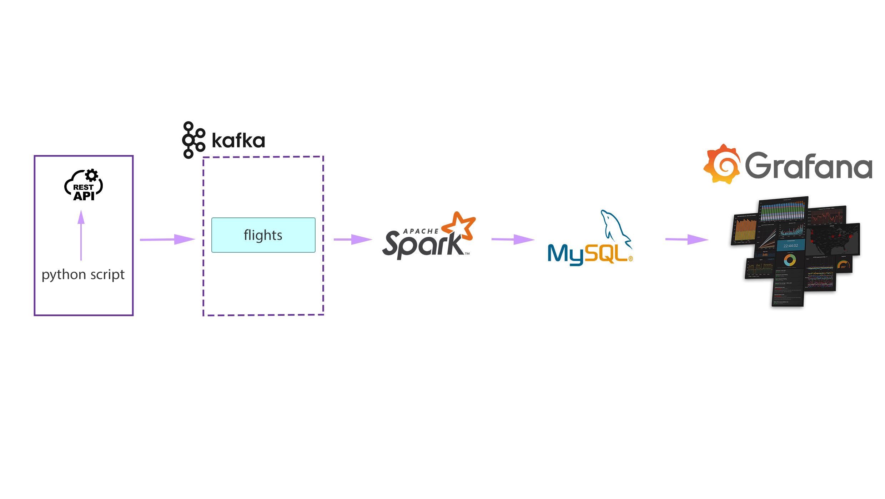
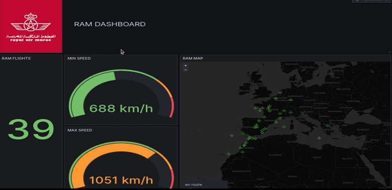
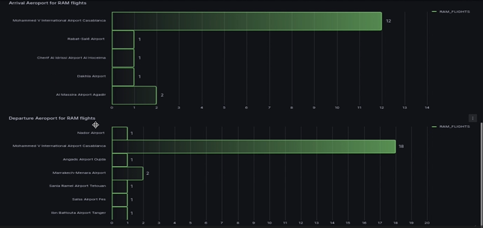

# RAM Flights Tracking

## Overview

This repository contains the code and configuration for a real-time data processing pipeline that uses Apache Spark with Scala and Spark Structured Streaming to process RAM flight data retrieved from an API. The project also utilizes Kafka as the real-time message broker, MySQL as the data store, and Grafana for data visualization. The goal of this project is to demonstrate how to set up and integrate these components on an Ubuntu environment for real-time data processing.

## Architecture



## Prerequisites

Before you begin, ensure you have the following prerequisites installed and configured on your Ubuntu system:

- **Kafka with Zookeeper:** Install and configure Kafka and Zookeeper as services. You can find installation instructions [here](https://kafka.apache.org/quickstart).

- **MySQL:** Install and set up MySQL as a service. Ensure you have a database and user ready for storing processed data.

- **Grafana:** Install Grafana and set it up as a service. You'll need to create a Grafana dashboard to visualize the real-time processed data.

- **Spark:** Install Apache Spark on your system. You can follow the installation guide [here](https://spark.apache.org/downloads.html).

- **Scala:** Set up the environment for Scala.

- **Python 3:** Ensure Python 3 is installed on your system.

## Project Structure

- `producer.py`: Python script for fetching real-time RAM flight data from an API and producing it to a Kafka topic.

- `server_script.sh`: Shell script for managing server-related tasks.

- Other Spark and Scala files for real-time data processing using Spark Structured Streaming and integration with Kafka and MySQL.

## Usage

1. **Producer Script**: Run the `producer.py` script to continuously fetch real-time RAM flight data and produce it to a Kafka topic.

   ```bash
   python3 producer.py

2. **Spark Structured Streaming**: Use Apache Spark with Scala and Spark Structured Streaming to consume real-time data from the Kafka topic, perform real-time processing, and sink the real-time results into the MySQL database.

3. **Grafana Dashboard**: Create a Grafana dashboard to visualize the real-time processed data. Configure Grafana to connect to your MySQL database as a data source and set up panels to display real-time metrics.

## Configuration

Update configuration files and environment variables as needed to match your Kafka, MySQL, and Grafana setups.

## Result






